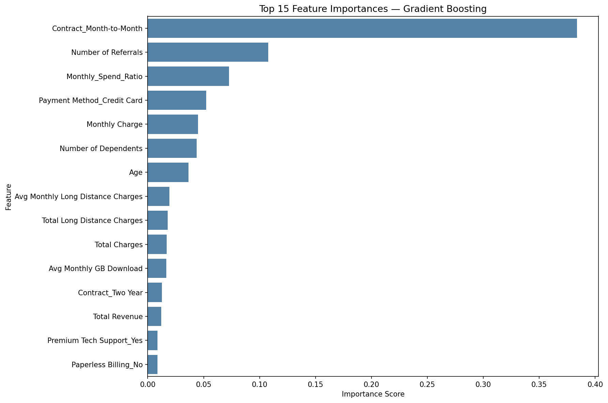
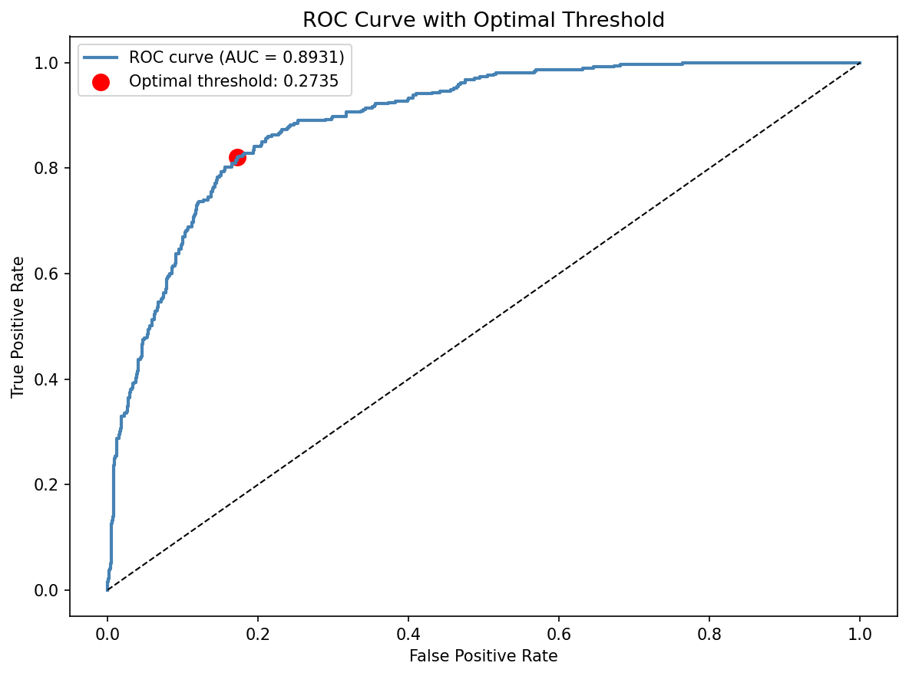
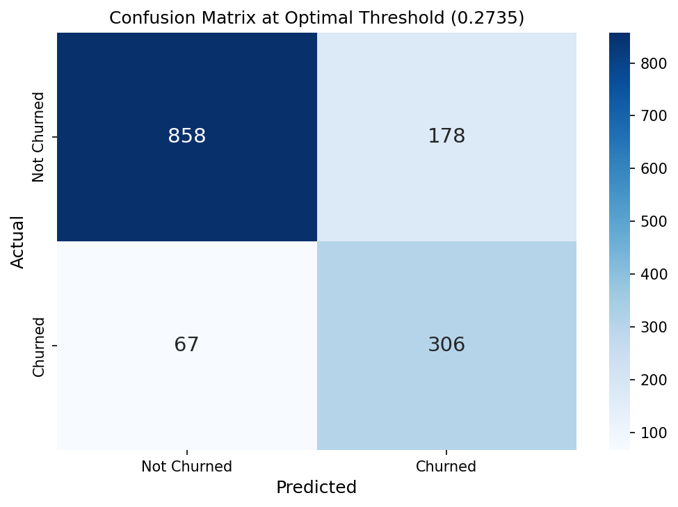

# User Retention And Churn Analysis

An end-to-end machine learning pipeline that predicts
customer churn with 82.61% accuracy and translates
model output into measurable business impact.

## Overview
This project builds a churn prediction system for a
telecom company — from raw data to optimised model
deployment. The goal is identifying at-risk customers
so targeted retention strategies can be applied
before customers leave.

## Tools & Technologies
- **Python** — core programming language
- **Pandas & NumPy** — data preprocessing and
  feature engineering
- **Scikit-learn** — machine learning pipeline
- **Imbalanced-learn (SMOTE)** — class imbalance handling
- **Matplotlib & Seaborn** — visualisation
- **Joblib** — model persistence

## Dataset
- **Source:** IBM Telecom Customer Churn dataset
- **Size:** 7,043 customers, 38 features
- **Target:** Customer Status (Churned / Stayed)
- **Class imbalance:** 73.4% stayed, 26.6% churned

## Methodology

### 1. Data Preprocessing
- Fixed negative values in monetary columns
- Handled missing values using median/mode imputation
- Converted zip codes to string format

### 2. Feature Engineering
- Created binary churn indicator
- Calculated tenure in years
- Built age group bins
- Counted premium services per customer
- Created Monthly Spend Ratio (charge / tenure)

### 3. Class Imbalance Handling
Applied SMOTE to balance training data:
- Before: 73.4% non-churners / 26.6% churners
- After: 50% / 50% balanced training set

### 4. Model Selection
Compared three algorithms:

| Model | Accuracy | ROC AUC |
|---|---|---|
| Logistic Regression | 83.39% | 0.8892 |
| Random Forest | 83.61% | 0.8779 |
| **Gradient Boosting** | **84.74%** | **0.9022** |

Gradient Boosting selected as best model.

### 5. Hyperparameter Tuning
RandomizedSearchCV with 5-fold cross-validation:
- Best ROC AUC: 0.9647
- Best parameters: n_estimators=300, max_depth=5,
  learning_rate=0.1, subsample=0.9

### 6. Threshold Optimisation
Default threshold (0.5) prioritises accuracy.
Optimal threshold (0.273) maximises business value
by catching more actual churners.

## Key Findings

### Top Churn Predictors (Feature Importance)
1. **Month-to-Month contracts** (0.384) — strongest
   predictor by far
2. **Number of referrals** (0.108) — more referrals
   = higher loyalty
3. **Monthly Spend Ratio** (0.073) — high spend
   relative to tenure = higher churn risk
4. **Payment Method** (0.052)
5. **Monthly Charge** (0.045)

## Results at Optimal Threshold (0.273)

| Metric | Value |
|---|---|
| Accuracy | 82.61% |
| Precision (non-churners) | 93% |
| Recall (churners) | 82% |
| True positives | 306 |
| False positives | 178 |
| False negatives | 67 |

## Business Impact Analysis

Calculated using assumed telecom industry benchmarks:
- Monthly revenue per customer: $70
- Average customer lifetime: 24 months
- Customer Lifetime Value (CLV): $1,680
- Retention offer cost: $50 per customer

| Business Metric | Value |
|---|---|
| Value from retained customers | $498,780 |
| Cost of retention offers | $8,900 |
| **Net benefit** | **$377,320** |
| **ROI** | **1,961%** |

*Note: Figures based on assumed industry benchmarks.
Actual impact depends on company-specific CLV
and retention costs.*

## Project Screenshots

### Feature Importance

### ROC Curve

### Confusion Matrix

## Repository Structure
